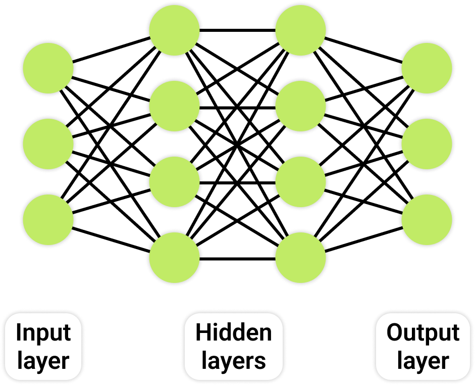
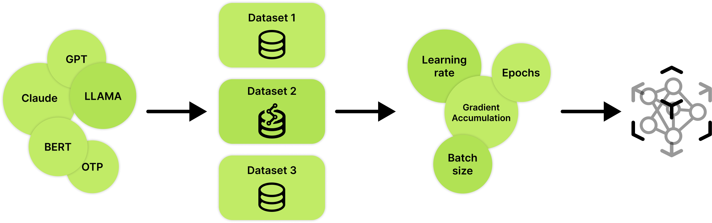

# IMPROVING CODE QUALITY USING FINE-TUNING LARGE LANGUAGE MODELS
A Comparative Analysis of Fine-tuned and Benchmark Models for Code Generation Capability

## Background Knowledge

## Fine-tuning Methods

## Evaluation Metrics

## Results
