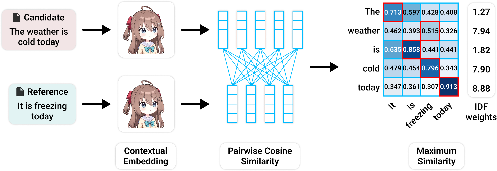

# IMPROVING CODE QUALITY USING FINE-TUNING LARGE LANGUAGE MODELS
A Comparative Analysis of Fine-tuned and Benchmark Models for Code Generation Capability

## Background Knowledge
### Perceptron

### Neural Network

### Transformer

## Fine-tuning Methods
### Parameter-Efficient Fine-Tuning (PEFT)

### Supervised Fine-tuning (STF)

### Direct Preference Optimization (DPO)

## Evaluation Metrics
### BERT Metrics

### CodeBLEU Metrics

## Results
### BERT

### CodeBERT

### BLEU

### Result Table

